# Benchmark Analysis Report

## 1. Summary

Mean end-to-end latency (µs) per (case, direction, transport):

| case | direction | transport | reliability | n_runs | mean | p50 | p95 | p99 |
| --- | --- | --- | --- | --- | --- | --- | --- | --- |
| exp_constrained_pub_only_xcdr | cpp_to_cpp | shmem_ds | best_effort | 2 | 113.481µs | 107.456µs | 174.621µs | 206.542µs |
| exp_constrained_pub_only_xcdr | cpp_to_py | shmem_ds | best_effort | 2 | 236.182µs | 226.512µs | 329.913µs | 382.654µs |
| exp_constrained_pub_only_xcdr | py_to_cpp | shmem_ds | best_effort | 2 | 125.262µs | 126.236µs | 194.3µs | 226.163µs |
| exp_constrained_pub_only_xcdr | py_to_py | shmem_ds | best_effort | 2 | 222.823µs | 210.454µs | 320.295µs | 377.098µs |
| exp_constrained_pub_sub_xcdr | cpp_to_cpp | shmem_ds | best_effort | 2 | 132.999µs | 128.481µs | 194.086µs | 233.832µs |
| exp_constrained_pub_sub_xcdr | cpp_to_py | shmem_ds | best_effort | 2 | 245.225µs | 244.278µs | 348.567µs | 476.048µs |
| exp_constrained_pub_sub_xcdr | py_to_cpp | shmem_ds | best_effort | 2 | 136.396µs | 135.33µs | 205.063µs | 276.669µs |
| exp_constrained_pub_sub_xcdr | py_to_py | shmem_ds | best_effort | 2 | 239.675µs | 235.709µs | 344.709µs | 445.756µs |
| exp_copy_xcdr | cpp_to_cpp | shmem_ds | best_effort | 2 | 376.64µs | 282.65µs | 939.649µs | 1.15492ms |
| exp_copy_xcdr | cpp_to_py | shmem_ds | best_effort | 2 | 468.724µs | 402.356µs | 988.926µs | 1.20096ms |
| exp_copy_xcdr | py_to_cpp | shmem_ds | best_effort | 2 | 440.124µs | 365.486µs | 987.119µs | 1.18793ms |
| exp_copy_xcdr | py_to_py | shmem_ds | best_effort | 2 | 536.448µs | 438.125µs | 1.0805ms | 1.22649ms |
| std_copy_fastcdr | cpp_to_cpp | shmem_ds | best_effort | 2 | 578.28µs | 414.381µs | 1.33243ms | 1.56722ms |
| std_copy_fastcdr | cpp_to_py | shmem_ds | best_effort | 2 | 1.52079ms | 1.46585ms | 3.02999ms | 3.19273ms |
| std_copy_fastcdr | py_to_cpp | shmem_ds | best_effort | 2 | 689.253µs | 558.83µs | 1.46752ms | 1.97457ms |
| std_copy_fastcdr | py_to_py | shmem_ds | best_effort | 2 | 1.45242ms | 1.5087ms | 2.90519ms | 3.30664ms |
| std_copy_xcdr | cpp_to_cpp | shmem_ds | best_effort | 2 | 464.271µs | 356.063µs | 1.10652ms | 1.28991ms |
| std_copy_xcdr | cpp_to_py | shmem_ds | best_effort | 2 | 817.157µs | 674.906µs | 1.61152ms | 1.80737ms |
| std_copy_xcdr | py_to_cpp | shmem_ds | best_effort | 2 | 568.107µs | 446.86µs | 1.29121ms | 1.45116ms |
| std_copy_xcdr | py_to_py | shmem_ds | best_effort | 2 | 1.39146ms | 1.27712ms | 2.91458ms | 3.42153ms |

> Key findings: compare transports within each (case, direction) row; see §4 for deltas. Cross-process end-to-end latency assumes NTP-synchronized host clocks.

## 2. Latency by Payload Size

### exp_constrained_pub_only_xcdr

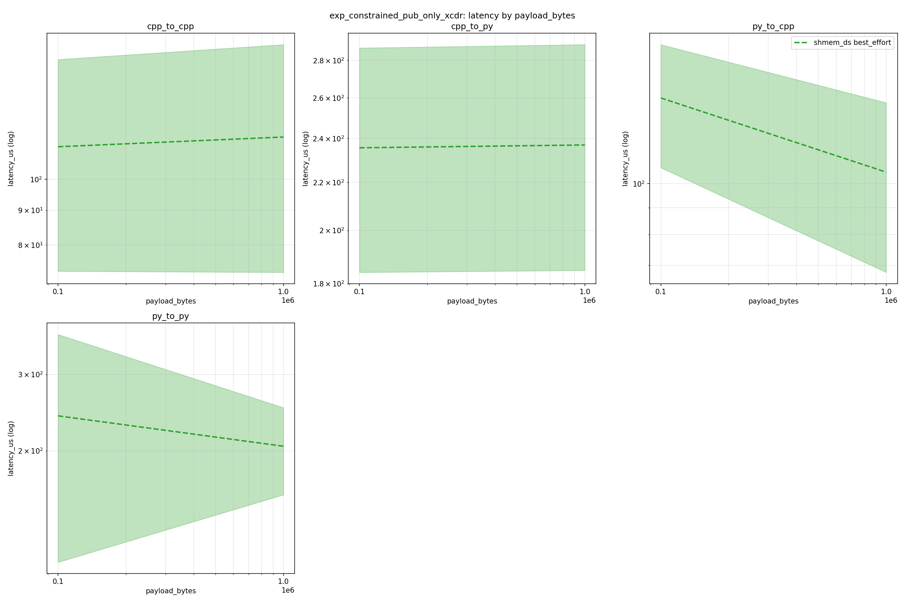

#### cpp_to_cpp

| transport | reliability | n_runs | mean | p50 | p95 |
| --- | --- | --- | --- | --- | --- |
| shmem_ds | best_effort | 2 | 113.48081395348837 | 107.4555 | 174.62145 |

#### cpp_to_py

| transport | reliability | n_runs | mean | p50 | p95 |
| --- | --- | --- | --- | --- | --- |
| shmem_ds | best_effort | 2 | 236.18198837209303 | 226.512 | 329.91294999999997 |

#### py_to_cpp

| transport | reliability | n_runs | mean | p50 | p95 |
| --- | --- | --- | --- | --- | --- |
| shmem_ds | best_effort | 2 | 125.26163787375414 | 126.23599999999999 | 194.30005 |

#### py_to_py

| transport | reliability | n_runs | mean | p50 | p95 |
| --- | --- | --- | --- | --- | --- |
| shmem_ds | best_effort | 2 | 222.8227093023256 | 210.454 | 320.29544999999996 |

### exp_constrained_pub_sub_xcdr

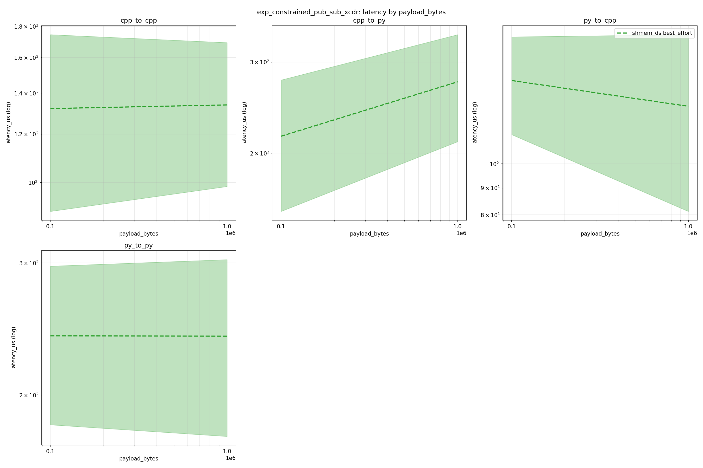

#### cpp_to_cpp

| transport | reliability | n_runs | mean | p50 | p95 |
| --- | --- | --- | --- | --- | --- |
| shmem_ds | best_effort | 2 | 132.99888870431894 | 128.481 | 194.08594999999997 |

#### cpp_to_py

| transport | reliability | n_runs | mean | p50 | p95 |
| --- | --- | --- | --- | --- | --- |
| shmem_ds | best_effort | 2 | 245.22539368770765 | 244.278 | 348.5665499999997 |

#### py_to_cpp

| transport | reliability | n_runs | mean | p50 | p95 |
| --- | --- | --- | --- | --- | --- |
| shmem_ds | best_effort | 2 | 136.39616943521597 | 135.32999999999998 | 205.063 |

#### py_to_py

| transport | reliability | n_runs | mean | p50 | p95 |
| --- | --- | --- | --- | --- | --- |
| shmem_ds | best_effort | 2 | 239.67505481727574 | 235.70850000000002 | 344.70894999999996 |

### exp_copy_xcdr

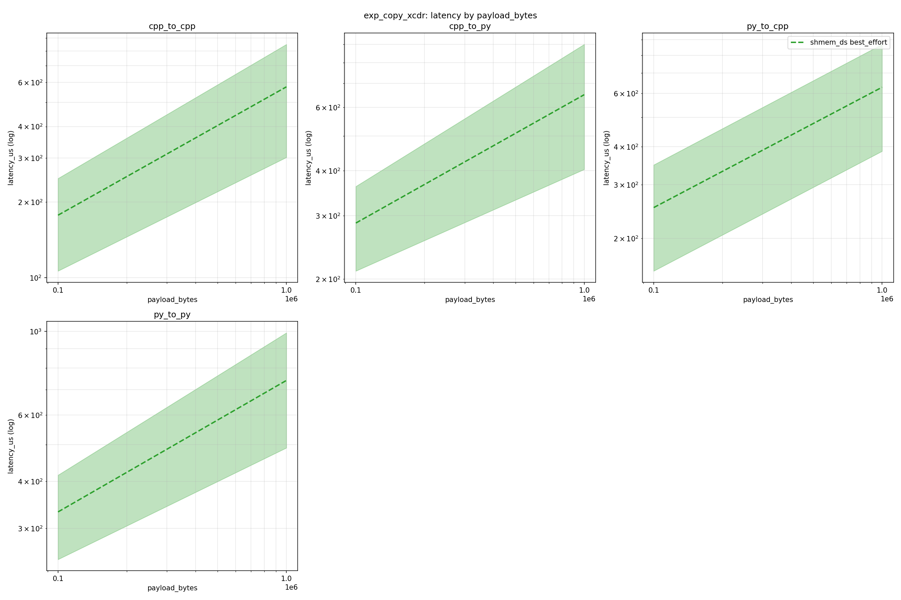

#### cpp_to_cpp

| transport | reliability | n_runs | mean | p50 | p95 |
| --- | --- | --- | --- | --- | --- |
| shmem_ds | best_effort | 2 | 376.6402375415283 | 282.65 | 939.6494999999996 |

#### cpp_to_py

| transport | reliability | n_runs | mean | p50 | p95 |
| --- | --- | --- | --- | --- | --- |
| shmem_ds | best_effort | 2 | 468.72374916943517 | 402.3565 | 988.926 |

#### py_to_cpp

| transport | reliability | n_runs | mean | p50 | p95 |
| --- | --- | --- | --- | --- | --- |
| shmem_ds | best_effort | 2 | 440.12374252491696 | 365.4865 | 987.1193999999999 |

#### py_to_py

| transport | reliability | n_runs | mean | p50 | p95 |
| --- | --- | --- | --- | --- | --- |
| shmem_ds | best_effort | 2 | 536.4476295681063 | 438.1245 | 1080.5036999999993 |

### std_copy_fastcdr

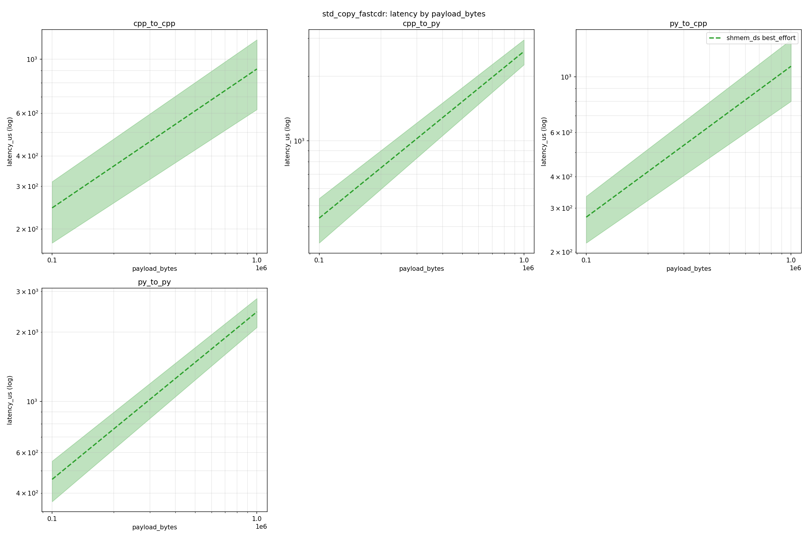

#### cpp_to_cpp

| transport | reliability | n_runs | mean | p50 | p95 |
| --- | --- | --- | --- | --- | --- |
| shmem_ds | best_effort | 2 | 578.2804401993355 | 414.38149999999996 | 1332.4298999999985 |

#### cpp_to_py

| transport | reliability | n_runs | mean | p50 | p95 |
| --- | --- | --- | --- | --- | --- |
| shmem_ds | best_effort | 2 | 1520.7912757475083 | 1465.8525 | 3029.9946999999993 |

#### py_to_cpp

| transport | reliability | n_runs | mean | p50 | p95 |
| --- | --- | --- | --- | --- | --- |
| shmem_ds | best_effort | 2 | 689.2528986710963 | 558.8299999999999 | 1467.5209 |

#### py_to_py

| transport | reliability | n_runs | mean | p50 | p95 |
| --- | --- | --- | --- | --- | --- |
| shmem_ds | best_effort | 2 | 1452.4168222591363 | 1508.7044999999998 | 2905.1884999999997 |

### std_copy_xcdr

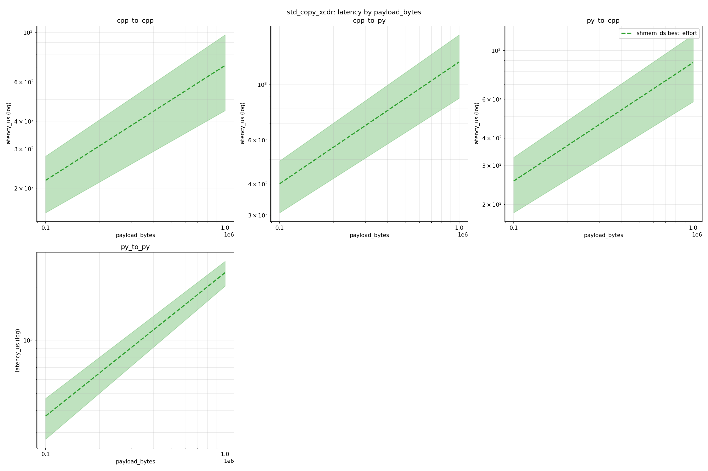

#### cpp_to_cpp

| transport | reliability | n_runs | mean | p50 | p95 |
| --- | --- | --- | --- | --- | --- |
| shmem_ds | best_effort | 2 | 464.2712408637874 | 356.0635 | 1106.5217499999999 |

#### cpp_to_py

| transport | reliability | n_runs | mean | p50 | p95 |
| --- | --- | --- | --- | --- | --- |
| shmem_ds | best_effort | 2 | 817.1572292358804 | 674.9055000000001 | 1611.5168999999999 |

#### py_to_cpp

| transport | reliability | n_runs | mean | p50 | p95 |
| --- | --- | --- | --- | --- | --- |
| shmem_ds | best_effort | 2 | 568.1067325581396 | 446.86 | 1291.2058499999994 |

#### py_to_py

| transport | reliability | n_runs | mean | p50 | p95 |
| --- | --- | --- | --- | --- | --- |
| shmem_ds | best_effort | 2 | 1391.4629867109634 | 1277.121 | 2914.5770999999995 |

## 3. Latency by Publishing Frequency

### exp_constrained_pub_only_xcdr

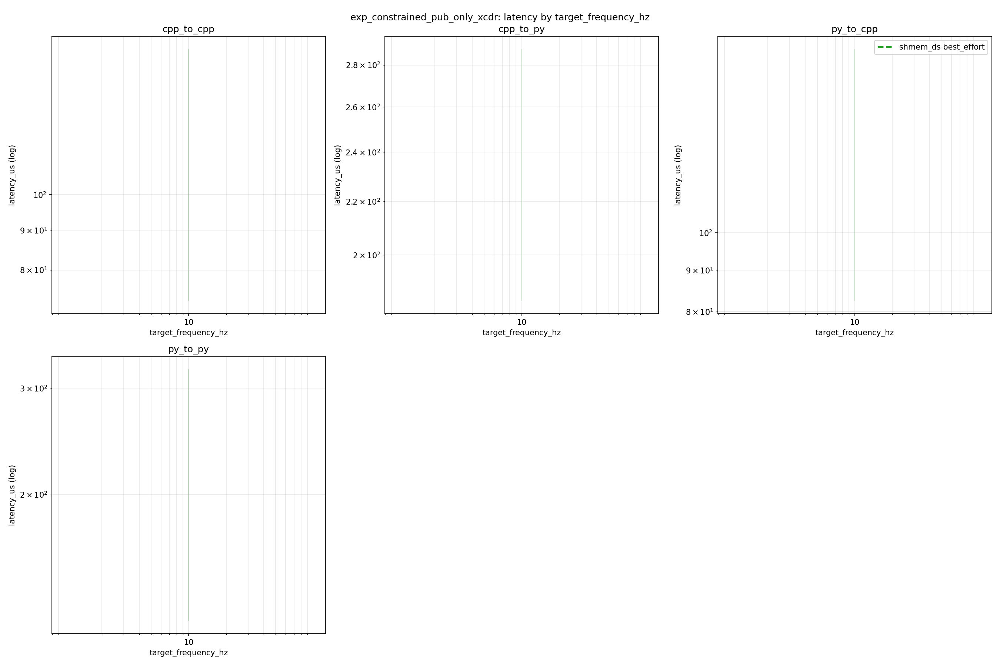

### exp_constrained_pub_sub_xcdr

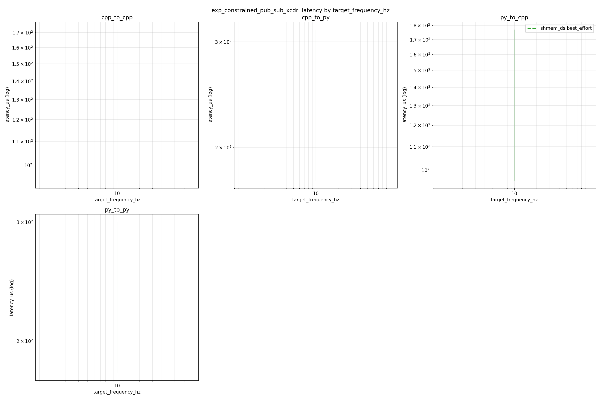

### exp_copy_xcdr

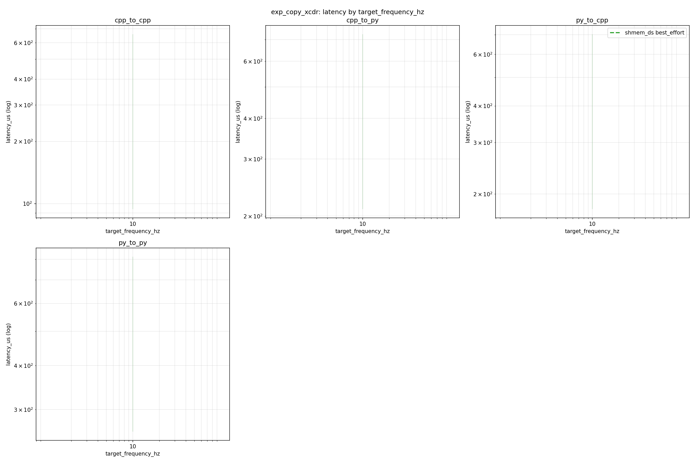

### std_copy_fastcdr

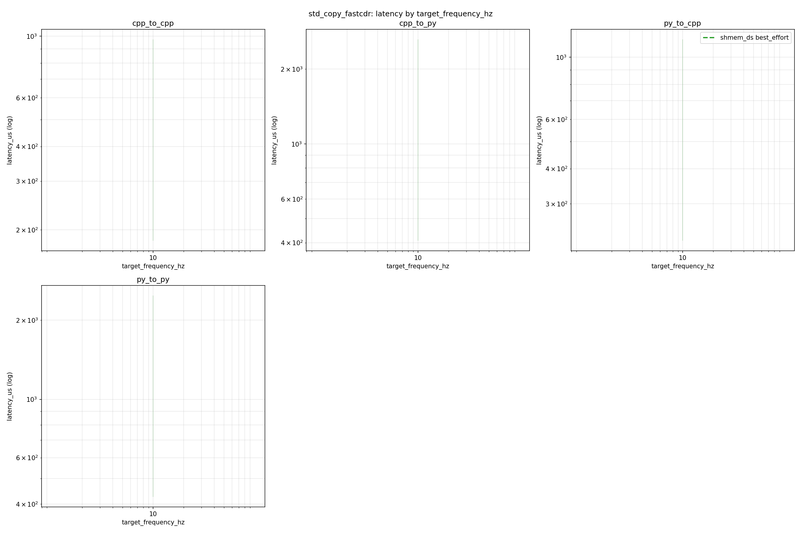

### std_copy_xcdr

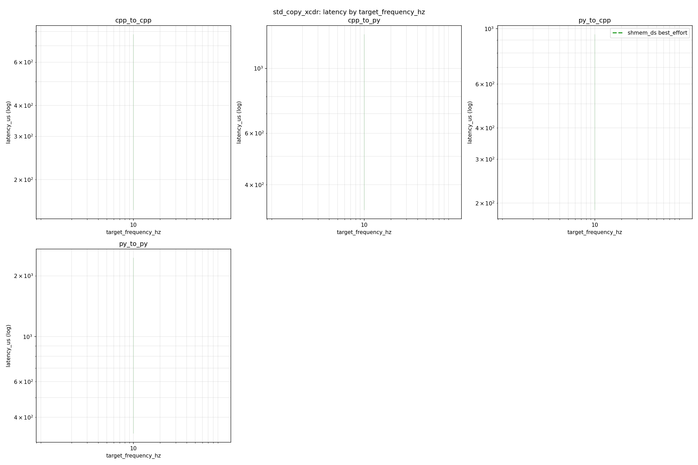

## 4. Transport Comparison

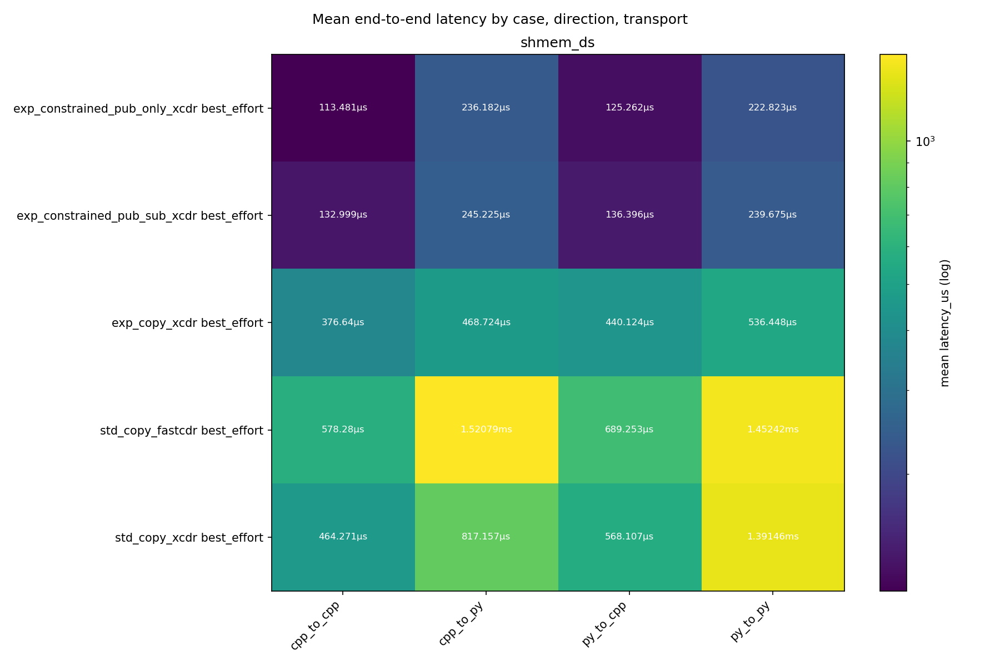

Not enough overlapping transports for deltas.

Single reliability level: no reliability deltas.

## 5. Time Series

### 100K@10Hz

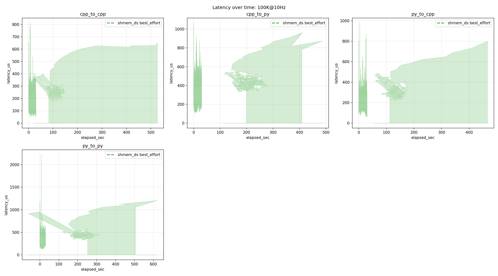

### 1M@10Hz

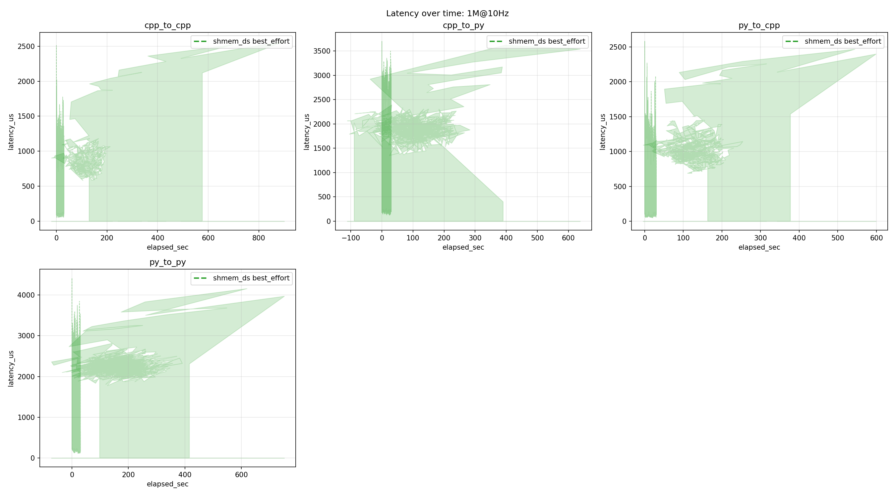

## 6. Drop Analysis

No drops recorded.

## 7. Pacing and Publish Jitter

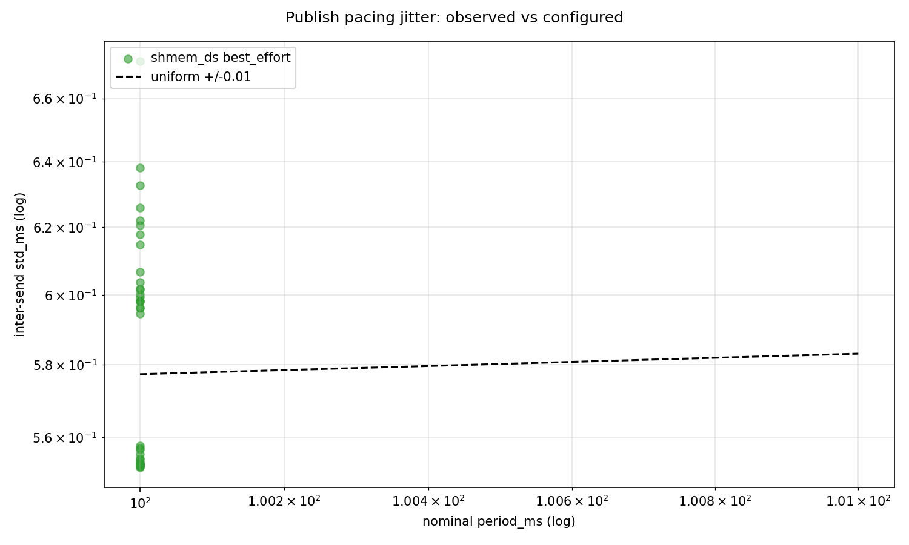

Observed inter-send jitter (std/mean) per (case, direction, transport). For uniform +/-j dither the ratio tends to j/sqrt(3) (~0.029 at the harness default 0.01); an exact metronome scores ~0. Systematic departures mean the configured dither did not reach the publisher.

| case | direction | transport | reliability | runs | mean | worst |
| --- | --- | --- | --- | --- | --- | --- |
| exp_constrained_pub_only_xcdr | cpp_to_cpp | shmem_ds | best_effort | 2 | 0.005557952602696132 | 0.00557212874501187 |
| exp_constrained_pub_only_xcdr | cpp_to_py | shmem_ds | best_effort | 2 | 0.005555141263339919 | 0.005578300484122246 |
| exp_constrained_pub_only_xcdr | py_to_cpp | shmem_ds | best_effort | 2 | 0.006267839701520187 | 0.0063278033826168496 |
| exp_constrained_pub_only_xcdr | py_to_py | shmem_ds | best_effort | 2 | 0.006149515781133438 | 0.006261132565263024 |
| exp_constrained_pub_sub_xcdr | cpp_to_cpp | shmem_ds | best_effort | 2 | 0.005552335951651801 | 0.005569447028603072 |
| exp_constrained_pub_sub_xcdr | cpp_to_py | shmem_ds | best_effort | 2 | 0.005542120714657913 | 0.005556425316314599 |
| exp_constrained_pub_sub_xcdr | py_to_cpp | shmem_ds | best_effort | 2 | 0.006265917254397716 | 0.006382685593508694 |
| exp_constrained_pub_sub_xcdr | py_to_py | shmem_ds | best_effort | 2 | 0.0064508210655584396 | 0.006721599090532385 |
| exp_copy_xcdr | cpp_to_cpp | shmem_ds | best_effort | 2 | 0.0055270721712788965 | 0.0055276673039151665 |
| exp_copy_xcdr | cpp_to_py | shmem_ds | best_effort | 2 | 0.005524600144003771 | 0.005528932838716998 |
| exp_copy_xcdr | py_to_cpp | shmem_ds | best_effort | 2 | 0.0059814482438785375 | 0.006017166341590876 |
| exp_copy_xcdr | py_to_py | shmem_ds | best_effort | 2 | 0.005993057150192172 | 0.0060021364726211696 |
| std_copy_fastcdr | cpp_to_cpp | shmem_ds | best_effort | 2 | 0.005528782811821754 | 0.005530218877419007 |
| std_copy_fastcdr | cpp_to_py | shmem_ds | best_effort | 2 | 0.005534017152308602 | 0.005540573990686191 |
| std_copy_fastcdr | py_to_cpp | shmem_ds | best_effort | 2 | 0.006102524274974742 | 0.006221598121722382 |
| std_copy_fastcdr | py_to_py | shmem_ds | best_effort | 2 | 0.005979742672899732 | 0.005995230521698796 |
| std_copy_xcdr | cpp_to_cpp | shmem_ds | best_effort | 2 | 0.005525763176425976 | 0.00552771712565814 |
| std_copy_xcdr | cpp_to_py | shmem_ds | best_effort | 2 | 0.005523886143165512 | 0.005523897250826691 |
| std_copy_xcdr | py_to_cpp | shmem_ds | best_effort | 2 | 0.00604340332087464 | 0.00606879984358924 |
| std_copy_xcdr | py_to_py | shmem_ds | best_effort | 2 | 0.005971720217845228 | 0.005980927899893571 |
