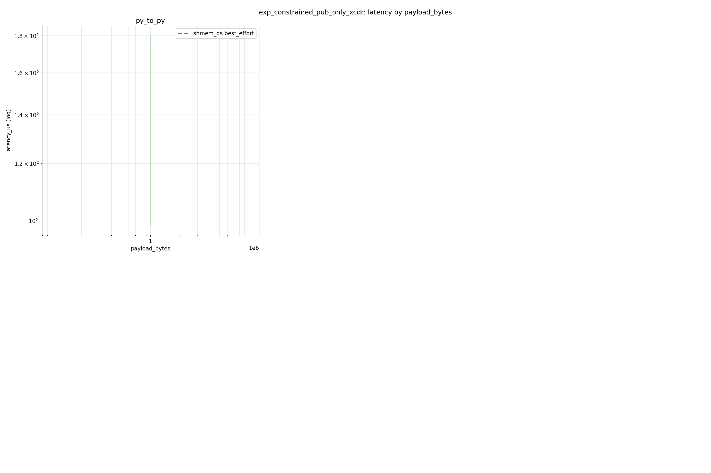
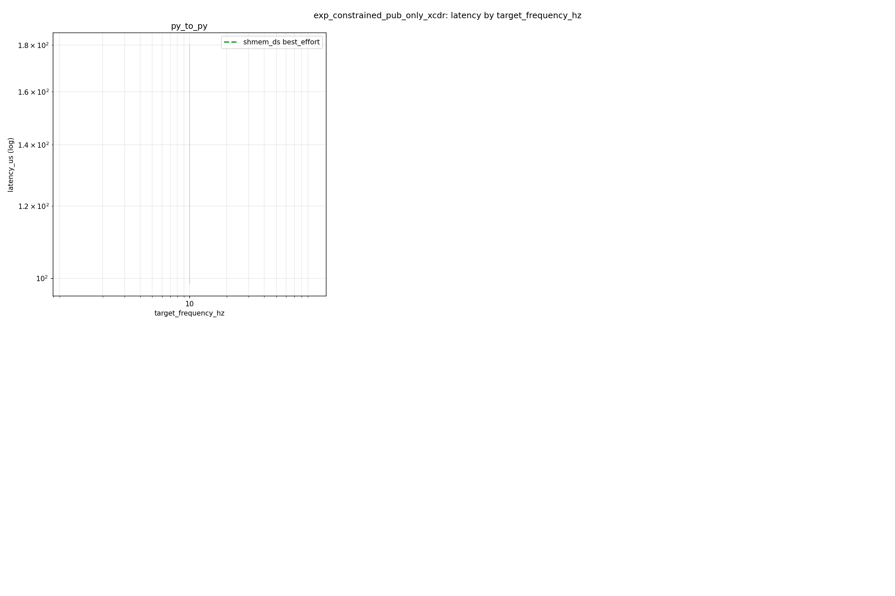
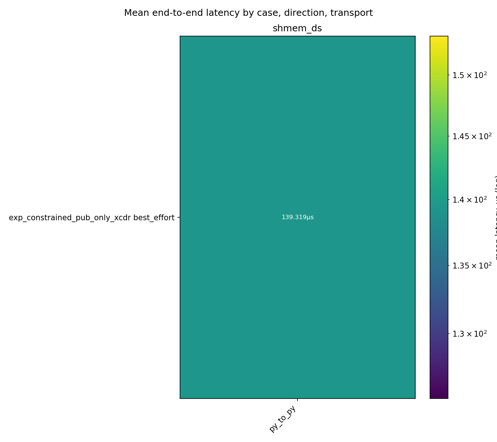
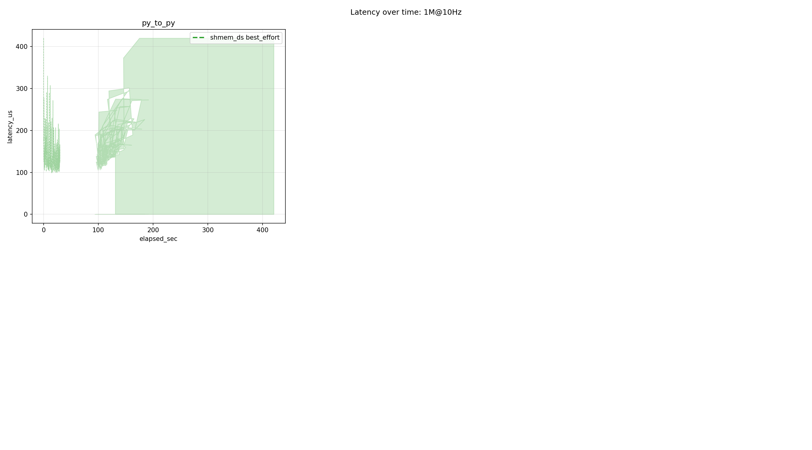
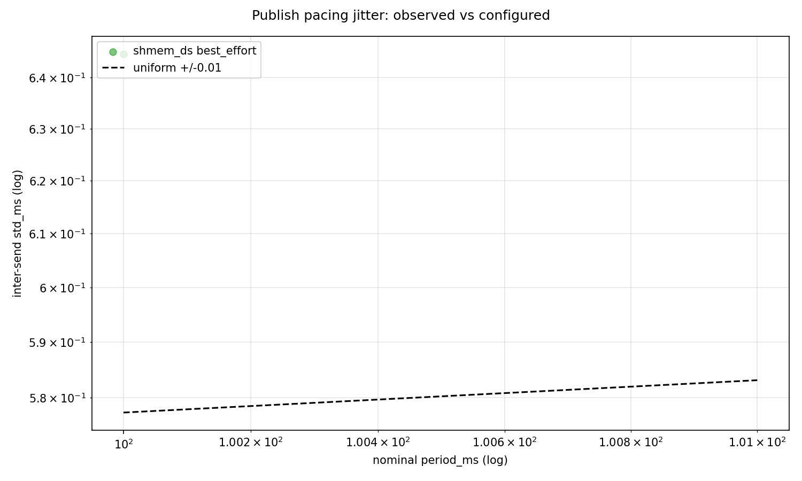

# Benchmark Analysis Report

## 1. Summary

Mean end-to-end latency (µs) per (case, direction, transport):

| case | direction | transport | reliability | n_runs | mean | p50 | p95 | p99 |
| --- | --- | --- | --- | --- | --- | --- | --- | --- |
| exp_constrained_pub_only_xcdr | py_to_py | shmem_ds | best_effort | 1 | 139.319µs | 127.622µs | 210.009µs | 291.282µs |

> Key findings: compare transports within each (case, direction) row; see §4 for deltas. Cross-process end-to-end latency assumes NTP-synchronized host clocks.

## 2. Latency by Payload Size

### exp_constrained_pub_only_xcdr

#### py_to_py

| transport | reliability | n_runs | mean | p50 | p95 |
| --- | --- | --- | --- | --- | --- |
| shmem_ds | best_effort | 1 | 139.3191727574751 | 127.622 | 210.009 |

## 3. Latency by Publishing Frequency

### exp_constrained_pub_only_xcdr

## 4. Transport Comparison

Not enough overlapping transports for deltas.

Single reliability level: no reliability deltas.

## 5. Time Series

### 1M@10Hz

## 6. Drop Analysis

No drops recorded.

## 7. Pacing and Publish Jitter

Observed inter-send jitter (std/mean) per (case, direction, transport). For uniform +/-j dither the ratio tends to j/sqrt(3) (~0.029 at the harness default 0.01); an exact metronome scores ~0. Systematic departures mean the configured dither did not reach the publisher.

| case | direction | transport | reliability | runs | mean | worst |
| --- | --- | --- | --- | --- | --- | --- |
| exp_constrained_pub_only_xcdr | py_to_py | shmem_ds | best_effort | 1 | 0.006447702329297523 | 0.006447702329297523 |
